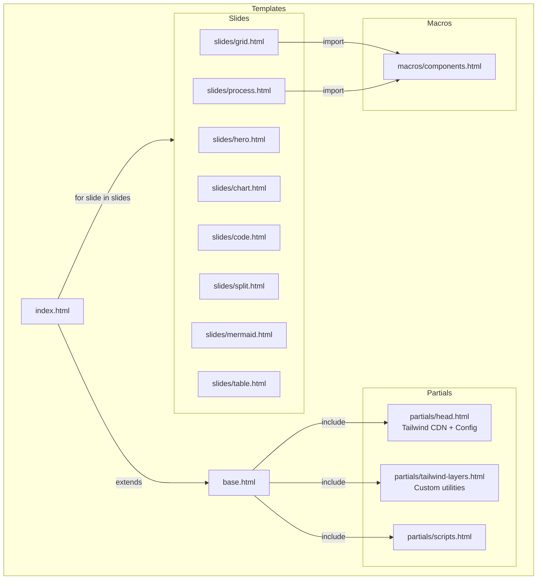

# Design: Modularize Template HTML + Tailwind CSS

## Architecture Overview



## Component Breakdown

### 1. Base Layout (`base.html`)
**Purpose**: Defines the HTML skeleton with Tailwind and placeholder blocks.

```jinja2
<!DOCTYPE html>
<html lang="it">
<head>
    
    
    
</head>
<body class="font-sans bg-transparent overflow-hidden text-text-primary leading-relaxed h-screen w-screen">
    <div class="background-fx fixed inset-0 -z-10"></div>
    <div class="presentation w-full h-full relative">
        
    </div>
    
    
</body>
</html>
```

### 2. Tailwind Head (`partials/head.html`)
**Purpose**: Load Tailwind CDN and configure theme from YAML.

```jinja2
<meta charset="UTF-8">
<meta name="viewport" content="width=device-width, initial-scale=1.0">
<title>{{ meta.title }}</title>

<!-- Fonts -->
<link href="https://fonts.googleapis.com/css2?family=Inter:wght@300;400;500;600;700&family=JetBrains+Mono:wght@400;500&display=swap" rel="stylesheet">

<!-- Libraries -->
<link rel="stylesheet" href="https://cdnjs.cloudflare.com/ajax/libs/highlight.js/11.9.0/styles/atom-one-dark.min.css">
<link rel="stylesheet" href="https://cdn.jsdelivr.net/npm/katex@0.16.9/dist/katex.min.css">
<link href="https://cdn.jsdelivr.net/npm/simple-datatables@latest/dist/style.css" rel="stylesheet">

<script src="https://cdn.jsdelivr.net/npm/chart.js"></script>
<script src="https://cdnjs.cloudflare.com/ajax/libs/highlight.js/11.9.0/highlight.min.js"></script>
<script src="https://cdn.jsdelivr.net/npm/mermaid@10.8.0/dist/mermaid.min.js"></script>
<script defer src="https://cdn.jsdelivr.net/npm/katex@0.16.9/dist/katex.min.js"></script>
<script defer src="https://cdn.jsdelivr.net/npm/katex@0.16.9/dist/contrib/auto-render.min.js"></script>
<script src="https://cdn.jsdelivr.net/npm/simple-datatables@latest"></script>

<!-- Tailwind CSS CDN -->
<script src="https://cdn.tailwindcss.com"></script>
<script>
    tailwind.config = {
        theme: {
            extend: {
                colors: {
                    bg: {
                        primary: '{{ theme.bg_primary | default("#020617") }}',
                        secondary: '{{ theme.bg_secondary | default("#f8fafc") }}',
                    },
                    accent: {
                        primary: '{{ theme.accent_primary | default("#22c55e") }}',
                        secondary: '{{ theme.accent_secondary | default("#0d9488") }}',
                        tertiary: '{{ theme.accent_tertiary | default("#16a34a") }}',
                    },
                    text: {
                        primary: '{{ theme.text_primary | default("#1e293b") }}',
                        secondary: '{{ theme.text_secondary | default("#475569") }}',
                    },
                    card: {
                        bg: 'rgba(255, 255, 255, 0.9)',
                        border: 'rgba(21, 128, 61, 0.2)',
                    }
                },
                fontFamily: {
                    sans: ['Inter', 'sans-serif'],
                    mono: ['JetBrains Mono', 'monospace'],
                },
                backdropBlur: {
                    glass: '20px',
                }
            }
        }
    }
</script>

<script>
    document.addEventListener('DOMContentLoaded', function () {
        if (typeof hljs !== 'undefined') hljs.highlightAll();
        if (typeof mermaid !== 'undefined') {
            mermaid.initialize({ startOnLoad: true, theme: 'dark' });
        }
    });
</script>
```

### 3. Tailwind Custom Layers (`partials/tailwind-layers.html`)
**Purpose**: Define reusable utility classes and component patterns.

```jinja2
<style type="text/tailwindcss">
    @layer utilities {
        /* Glass Card Effect */
        .glass-card {
            @apply bg-white/90 backdrop-blur-[20px] rounded-xl border border-card-border shadow-lg;
        }
        
        /* Gradient Text */
        .text-gradient {
            @apply bg-clip-text text-transparent bg-gradient-to-br from-accent-primary to-slate-900;
        }
        
        /* Slide Base */
        .slide {
            @apply absolute inset-0 p-[60px_100px] opacity-0 invisible transition-all duration-500 ease-out translate-y-5 flex flex-col;
        }
        
        .slide.active {
            @apply opacity-100 visible translate-y-0 z-10;
        }
        
        /* Stagger Animations */
        .stagger-1 {
            animation: fadeUp 0.8s cubic-bezier(0.2, 0.8, 0.2, 1) 0.1s forwards;
            @apply opacity-0 translate-y-5;
        }
        .stagger-2 {
            animation: fadeUp 0.8s cubic-bezier(0.2, 0.8, 0.2, 1) 0.2s forwards;
            @apply opacity-0 translate-y-5;
        }
        .stagger-3 {
            animation: fadeUp 0.8s cubic-bezier(0.2, 0.8, 0.2, 1) 0.3s forwards;
            @apply opacity-0 translate-y-5;
        }
    }
    
    @layer components {
        /* Process Step */
        .process-step {
            @apply flex-1 glass-card p-6 border-t-4 border-t-accent-tertiary;
        }
        .process-step:nth-child(2) {
            @apply border-t-accent-secondary;
        }
        .process-step:nth-child(3) {
            @apply border-t-accent-primary;
        }
        
        /* Tech Badge */
        .tech-badge {
            @apply text-xs px-3 py-1 rounded-full bg-emerald-50 border border-green-200 text-green-800 font-semibold tracking-wide;
        }
        
        /* ID Badge */
        .id-badge {
            @apply font-mono bg-accent-tertiary/10 px-3 py-1 rounded-md text-accent-tertiary font-semibold;
        }
    }
    
    @keyframes fadeUp {
        to {
            opacity: 1;
            transform: translateY(0);
        }
    }
    
    /* Background FX - Requires Jinja logic */
    .background-fx {
        
        
        
        background-color: {{ theme.bg_primary | default('#ffffff') }};
        
        
        background-image: none;
        
        background-image: linear-gradient(
            {{ bg.linear_gradient.angle }},
            
            {{ stop.color }} {{ stop.pos }},
            
        );
        
        /* Default abstract gradient */
        background-image: 
            radial-gradient(at 15% 25%, rgba(22, 163, 74, 0.12) 0px, transparent 55%),
            radial-gradient(at 85% 75%, rgba(13, 148, 136, 0.12) 0px, transparent 55%),
            radial-gradient(at 50% 50%, rgba(22, 163, 74, 0.05) 0px, transparent 60%),
            linear-gradient(135deg, #ffffff 0%, #f7fdf9 50%, #ecfdf5 100%);
        
    }
</style>
```

### 4. Slide Templates with Tailwind

Example: `slides/grid.html`
```jinja2


<div class="slide active">
    <h2 class="text-4xl font-semibold text-text-primary mb-4 flex items-center tracking-tight">
        {{ slide.title }}
        <span class="flex-1 h-0.5 bg-gradient-to-r from-accent-primary to-transparent ml-8 opacity-30"></span>
    </h2>
    
    
        <div class="prose prose-slate text-lg text-text-secondary max-w-4xl mb-10 stagger-1">
            {{ slide.lead | markdown }}
        </div>
    
    
    <div class="grid grid-cols-3grid-cols-2 gap-6 flex-1 content-start">
        
            {{ render_card(card, loop.index0) }}
        
    </div>
</div>
```

### 5. Macros with Tailwind (`macros/components.html`)

```jinja2

<div class="glass-card p-7 h-full flex flex-col stagger-{{ index % 3 + 1 }} hover:shadow-xl transition-shadow duration-300">
    <h3 class="text-xl font-bold mb-3 text-text-primary">{{ card.title }}</h3>
    
        <div class="prose prose-slate text-text-secondary">{{ card.text | markdown }}</div>
    
    
        <ul class="mt-auto space-y-2">
            
                <li class="relative pl-5 text-text-secondary before:content-['•'] before:absolute before:left-0 before:text-accent-primary before:font-bold">
                    {{ item | markdown }}
                </li>
            
        </ul>
    
</div>



<div class="flex flex-wrap gap-2">
    
        <span class="tech-badge">{{ badge }}</span>
    
</div>



<div class="process-step">
    <div class="text-xs uppercase tracking-widest mb-2 text-accent-primary font-semibold">
        {{ step.header }}
    </div>
    <h3 class="text-lg font-bold mb-2 text-text-primary">{{ step.title }}</h3>
    <div class="prose prose-sm prose-slate">{{ step.text | markdown }}</div>
</div>

```

## Tailwind Typography for Markdown

The `prose` class from Tailwind Typography handles all markdown-rendered content automatically:

```html
<div class="prose prose-slate">
    {{ content | markdown }}
</div>
```

This replaces all the `.markdown-body` CSS rules (~60 lines) with a single class.

> [!NOTE]
> The CDN version includes `@tailwindcss/typography` by default.

## Migration Strategy

### Phase 1: Create Infrastructure
1. Create folder structure: `partials/`, `slides/`, `macros/`
2. Create `base.html` with Tailwind setup
3. Create `partials/head.html` with Tailwind CDN and config
4. Create `partials/tailwind-layers.html` with custom utilities

### Phase 2: Create Macros
1. Create `macros/components.html` with Tailwind-based macros
2. Implement `render_card`, `render_badge_list`, `render_process_step`

### Phase 3: Extract Slide Templates
For each slide type, create a new file with Tailwind utility classes:
- `slides/hero.html`
- `slides/grid.html`
- `slides/process.html`
- `slides/chart.html`
- `slides/code.html`
- `slides/split.html`
- `slides/mermaid.html`
- `slides/table.html`

### Phase 4: Create Entry Point
1. Create `templates/index.html` that extends `base.html`
2. Implement the slide loop with dynamic includes

### Phase 5: Scripts Partial
1. Move navigation JS to `partials/scripts.html`
2. Include KaTeX initialization

### Phase 6: Verification
1. Generate presentation with new template system
2. Visual comparison with original output
3. Test all slide types

## Portable Export Strategy

For offline portable exports, modify `bundler.py`:

### Option A: Bundle Tailwind Script
1. Download `https://cdn.tailwindcss.com` to `assets/tailwindcss.js`
2. Inline the script in the bundled HTML
3. Tailwind compiles CSS at runtime in the browser

### Option B: Pre-compile CSS (Recommended for Offline)
1. Install Tailwind CLI standalone binary
2. During bundling, run: `tailwindcss -i input.css -o output.css --minify`
3. Inline the compiled CSS, remove Tailwind script dependency

```python
# bundler.py addition
def compile_tailwind_css(template_html):
    # Extract <style type="text/tailwindcss"> content
    # Run Tailwind CLI to compile
    # Replace with compiled CSS
    pass
```
